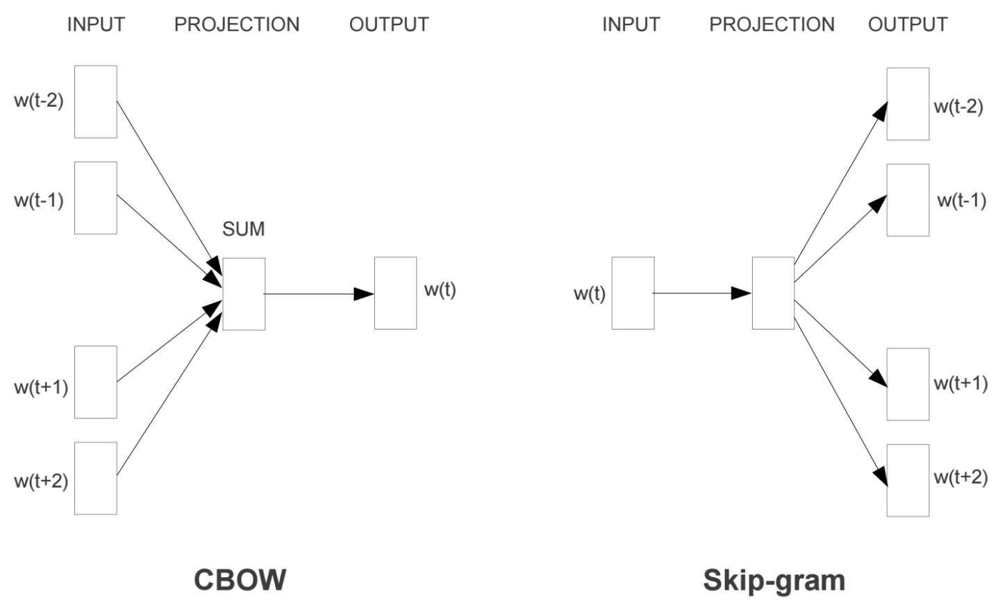

# Word2Vec

### word2vec

word2vec是在NNLM上的突破，实际上并不算是一个深度学习神经网络，因为事实上它只有两层。word2vec也并不算得上一个模型，而是一个工具，真正的模型是word2vec后面的skip-gram和CBOW\(Continue Bag-Of-Words\)模型。

Skip-gram和CBOW的模型结构： 

Word2Vec采用了negative sampling, hierachical softmax等技术对训练进行了优化，这两个操作都是在softmax输出层上进行优化。同时，也基于NEG和H-Softmax两种方式对两个神经网络进行搭建。（注：这两种技术都可以用在skip-gram和CBOW中，但是不能同时使用）

* **负例采样\(negative sampling\):** 对于我们在训练原始文本中遇到的每一个单词，它们都有一定概率被我们从文本中删掉，而这个被删除的概率与单词的频率有关。删除的概率为\(sqrt\(x/threshold\)+1\)\*\(threshold/x\),其中x为词频。词语数量\|V\|的大小决定了训练神经网络的时候会拥有大规模的权重矩阵W，所有的这些权重矩阵需要数以亿计的样本进行调整，这不仅很消耗计算资源，而且在实际训练中效率非常慢。负采样每次只让一个样本更新仅仅更新一小部分的权重，从而降低计算量。除了当前单词，其他单词被当做是negative sample，一个单词被选作negative sample的概率跟它出现的频次有关，出现频次越高的单词越容易被选作negative words。被选做negative word的概率为x^\(3/4\)/∑x^\(3/4\),x代表词频。
* **层次Softmax\(Hierachical Softmax\):** 采用哈夫曼树的树形结构，同时采用logistics function作为路径二分类的概率分布输出。表示输出，这样可以大大的减少Softmax的计算量，从O\(N\)变成O\(log\(N\)。

TO-DO:补充推导笔记图片\*\*

> 假设一个句子S由n个词组成

从直观上理解**Skip-gram**是通过输入第i个词\(center\)，1&lt;=i&lt;=n，来预测其他词语，也就是上下文\(context\)出现的概率，而**CBOW**是通过上下文的词语，来估算当前词语i的语言模型。

**skip-gram过程:**先将当前单词转成one-hot词向量，然后随机生成一个Vocabulary\_size\*embeding\_dim大小的权重矩阵，通过one-hot向量与权重矩阵相乘，得到当前词语向量中的权重向量，然后跟其他词语的one-hot向量相乘，得到的数值再通过softmax将其归一化，最后得到每个词的概率分布，最后根据这个概率分布，得到最大的那个值就是我们要输出的单词的下标。

**CBOW过程:**先将上下文单词转换成one-hot向量，然后通过一个初始化权重矩阵将向量的值相加后求平均值，之后再乘以一个输出权重矩阵计算出一个概率值去预测center值的概率分布。

_Reference-《word2vec中的数学原理详解》:_[https://www.cnblogs.com/peghoty/p/3857839.html](https://www.cnblogs.com/peghoty/p/3857839.html)

